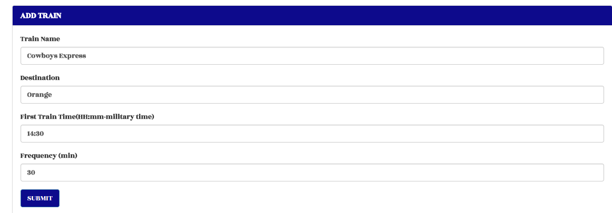

# Train-Schedule
### Created a train schedule app using Firebase, JavaScript, Moment.js, jQuery, HTML, and CSS.

Provides up-to-date information about the trains, such as arrival times and how many minutes remain until they arrive at their station.
User inputs train information. 

